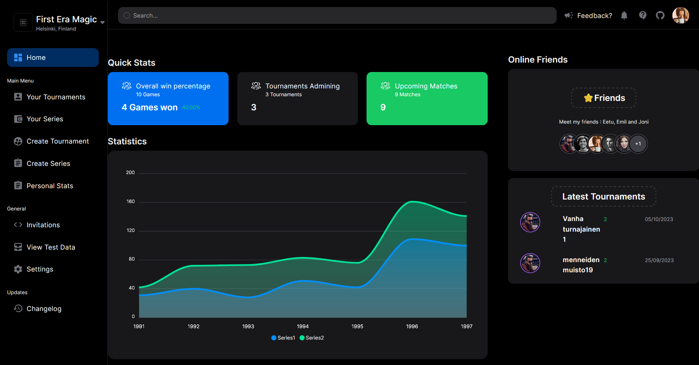

# Maketournaments

Create and join Magic tournaments across the world!

## Description



Maketournaments is Magic the Gathering Tournament tracker. You can use it to create and join tournaments created by yourself or other users. Tournaments can have custom rulesets, and multiple matches between different players. Tournaments can either exist on their own or as a part of a series.

To get started, register an account, create a tournament and invite other people you know to participate!

Maketournaments®️©️™️: Built for Magic the Gathering players, by Magic the Gathering players.

## Getting Started

### Setting it up

- .env.local file should be prersent in the project root with following variables:

  ```bash
  NEXTAUTH_SECRET: <secret>
  TOKEN_SECRET: <secret>
  MONGO_URI: <database_url>
  MONGO_URI_TEST: <database_url, start application using this with npm run testserver>
  NEXT_PUBLIC_URL: <address application is run at, for example http://localhost:3000>
  ```

### Installing

```bash
git clone https://github.com/rocksanen/maketournaments.git
npm install
# create .env.local -file & insert environment variables
npm run dev
```

### Notes

- Each series contains tournaments, and each tournament contains matches, you can invite other people to tournaments in 'Your tournaments' view by clicking the pen icon.

- Apollo sandbox is present at /apollo route.

- Rulesets can be selected or created at Create Tourney screen.

- Login, Signup and Profile are access by icon at top right corner.

- GraphQL mutations can not be accessed by unauthenticated users. You must be logged in. To test mutations with Apollo Sandbox you must run the application with
  'npm run testserver'

### Running tests

- Tests are run in separate database and in enviroment that allows mutations by everyone. To create test enviroment run:

```bash
# use MONGO_URI_TEST for db, and set variable ENV=test
npm run testserver
# then in another console window run tests with
npm run test
```

## Help

In case of problems and issues, [you may create a ticket here](https://github.com/rocksanen/maketournaments/issues)

## Authors

- Otto Oksanen [(GitHub)](https://github.com/rocksanen)
- Joni Lassila [(GitHub)](https://github.com/LassilaJoni)
- Emil Ålgars [(GitHub)](https://github.com/emilalg)
- Eetu Soronen [(GitHub)](https://github.com/soronen)

## License

All rights reserved™️

## Acknowledgments

- [Hard work and dedication](https://i.imgur.com/TbHa8vR.jpeg)
